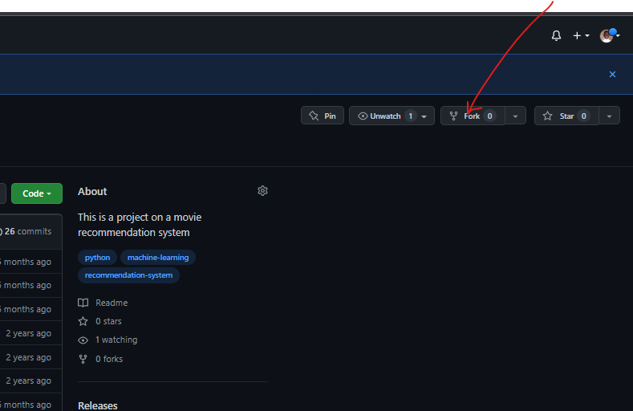
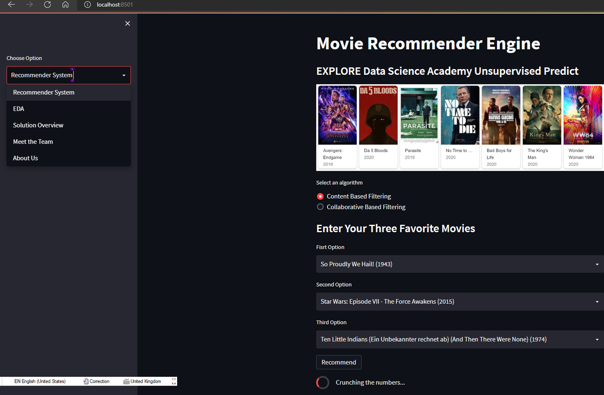

# A PROJECT ON MOVIE RECOMMENDER SYSTEMS


## 1) OVERVIEW?
This repository documents work done by a team of EXPLORE AI students in fulfilment of the requirement for Professional Certification in Data Science.

#### 1.1) What is a Recommender System?
Recommender systems are the unsung heroes of our modern technological world. Search engines, online shopping, streaming multimedia platforms, news-feeds - all of these services depend on recommendation algorithms in order to provide users the content they want to interact with.

At a fundamental level, these systems operate using similarity, where we try to match people (users) to things (items). Two primary approaches are used in recommender systems are content-based and collaborative-based filtering.  In content-based filtering this similarity is measured between items based on their properties, while collaborative filtering uses similarities amongst users to drive recommendations.

COMET ☄️ was used for code versioning during model development.

For this repository, please refer to the following files:

| File Name              | Description                                      |
| :--------------------- | :--------------------                            |
| `Team 4`               | Keeps the main code file (Jupyter notebook)      |
| `recommenders`         | Contains dependency code for the recommender App |
| `resources`            | Datasets and base files                          |
| `edsa_recommender.py`  | Streamlit App file                               |

## 2) Project Usage Instruction

#### 2.1) Creating a copy of this repo

||| Kindly ```fork``` the repo and upvote if you find helpful.

  

To fork the repo, simply ensure that you are logged into your GitHub account, and then click on the 'fork' button at the top of this page as indicated within the figure above.

#### 2.2) Running the Streamlit web app on your local machine

As a first step to becoming familiar with our web app's functioning, we recommend setting up a running instance on your own local machine.

To do this, follow the steps below by running the given commands within a Git bash (Windows), or terminal (Mac/Linux):

 1. Ensure that you have the prerequisite Python libraries installed on your local machine: The uncommon libraries are mentioned below. Please refer to the notebook, on the IMPORT PACKAGES section for full requirements.

 ```bash
 pip install -U streamlit numpy pandas scikit-learn fuzzywuzzy surprise
  ```

 2. Clone the *forked* repo to your local machine.

 ```bash
 git clone https://github.com/{your-account-name}/A-Movie-Recommendation-System-_-EDSA-Capstone-Project.git
 ```  

 3. Navigate to the base of the cloned repo, and start the Streamlit app.

 ```bash
 streamlit run edsa_recommender.py
 ```

 If the web server was able to initialise successfully, the following(or something similar) message should be displayed within your bash/terminal session:

```
  You can now view your Streamlit app in your browser.

    Local URL: http://localhost:8501
    Network URL: http://192.168.43.124:8501
```

You should also be automatically directed to the base page of your web app. This should look something like:



Thanks for interacting! Recommendations are welcome.
